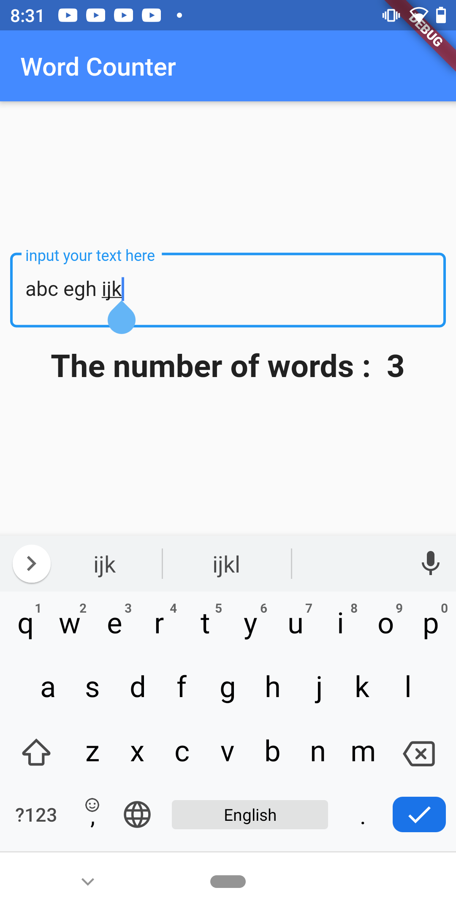

# text_counter

A simple fultter app that counts number of words that are typed dynamically on the go

## what will you learn

1: use of stateless widget
2: use of TextField
3: use of Stateful widget to handle state

